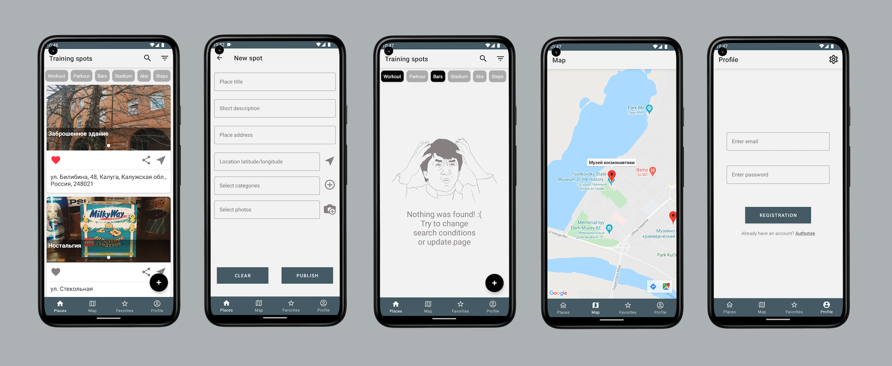

# StreetWorkout
Here is a simple mobile app for Android, which helps you to find training spots all over the world. Builded with modern [Android Jetpack](https://developer.android.google.cn/jetpack/getting-started?hl=en) :rocket: components and  [Firebase Services](https://firebase.google.com/) :fire:. 
Application is **under development**, I always try to add useful features and evolve code base. 

***Here is the latest version of StreetWorkout*** :arrow_down_small:

## Screenshots:

## Main features:
Training spots loads from Firebase Realtime Database and persisted with Room. Images hosted in Cloud Storage. Spots will be always loaded from local database and synchronized with remote data. Some other features listed below:
- Authorization in app with Firebase auth
- Training spots list with photo slider, address, quick buttons
- Search and filtering spots by category. Works mutually with each other
- Authorise and publish your spots, share it with others!
- Showing spots on map, convenient to see spots beside your current position
- Add interesting spots to favourites. Rollback ability if removed accidentally 
- Handle empty list and search/filter states with a kind of humour ;)
- Bottom navigation view without shift animation for better UX
- Multiple language support, night theme support and so on!

# Technical Stack :hammer:
- [Android Architecture Components](https://developer.android.com/topic/libraries/architecture) - Collection of libraries that help you design robust, testable, and maintainable apps.
  - [LiveData](https://developer.android.com/topic/libraries/architecture/livedata) - Data objects that notify views when the underlying database changes.
  - [ViewModel](https://developer.android.com/topic/libraries/architecture/viewmodel) - Stores UI-related data that isn't destroyed on UI changes. 
  - [Navigation](https://developer.android.com/topic/libraries/architecture/navigation/) - Handle everything needed for in-app navigation.
  - [ViewBinding](https://developer.android.com/topic/libraries/view-binding) - Generates a binding class for each XML layout file, allows you to more easily write code that interacts with views.
  - [Room](https://developer.android.com/topic/libraries/architecture/room) - SQLite object mapping library.
- [Kotlin](https://kotlinlang.org/) - First class and official programming language for Android development.
- [Dagger 2](https://dagger.dev/) - Fully static, compile-time dependency injection framework for Java, Kotlin, and Android.
- [Coroutines](https://kotlinlang.org/docs/reference/coroutines-overview.html) - For managing background threads with simplified code and reducing needs for callbacks.
- [Material Components for Android](https://github.com/material-components/material-components-android) - Modular and customizable Material Design UI components for Android.
- [Firebase](https://firebase.google.com/) - Servless set of solutions for your app, helps you build and run successful apps.

## Upcoming features:
- New settings screen
- Share spots functionality
- First UI tests
- **And many others!**
